# Tulifo Gig Backend — Complete Documentation

> **Platform**: Tulifo Gig — A freelancing / gig economy platform  
> **Architecture**: Polyglot Microservices Monorepo  
> **Last Updated**: February 2026

---

## Table of Contents

1. [Backend Architecture Diagram](#1-backend-architecture-diagram)
2. [Backend Flow Diagram](#2-backend-flow-diagram)
3. [System Design](#3-system-design)

---

## 1. Backend Architecture Diagram

### 1.1 High-Level Architecture Overview

```mermaid
graph TB
    subgraph "Client Layer"
        WEB["🌐 Web App<br/>(Next.js / React)"]
        MOB["📱 Mobile App"]
    end

    subgraph "API Gateway Layer"
        VERCEL["☁️ Vercel Gateway<br/>(api/gateway.ts)<br/>Production Routing"]
        KONG["🦍 Kong API Gateway<br/>:8000 / :8443<br/>Local Dev Routing"]
        KONGA["📊 Konga Dashboard<br/>:1337<br/>Kong Admin UI"]
    end

    subgraph "Node.js Services (Express + TypeScript)"
        AUTH["🔐 Auth Service<br/>:3001<br/>JWT + bcrypt"]
        USER["👤 User Service<br/>:3002<br/>Profiles & Settings"]
        PROJECT["📋 Project Service<br/>:3003<br/>Projects & Bids"]
        PAYMENT["💳 Payment Service<br/>:3004<br/>Stripe Integration"]
        MSG["💬 Message Service<br/>:3005<br/>Socket.IO + MongoDB"]
        NOTIF["🔔 Notification Service<br/>:3006<br/>Email + Push"]
        SESSION["🕐 Session Service<br/>:3009<br/>Session Tracking"]
        WORKER["⚙️ Worker Service<br/>:3010<br/>Background Jobs"]
        CLIENT_SVC["🏢 Client Service<br/>:3011<br/>Client Billing"]
        ESCROW["🏦 Escrow Service<br/>:3012<br/>Fund Holding"]
        DISPUTE["⚖️ Dispute Service<br/>:3013<br/>Resolution"]
        REVIEW["⭐ Review Service<br/>:3014<br/>Ratings & Reviews"]
        SEARCH["🔍 Search Service<br/>:3015<br/>Elasticsearch"]
    end

    subgraph "Go Service"
        BOOKING["📅 Booking Service<br/>:3007<br/>Go + Gin"]
    end

    subgraph "Python Service"
        MATCHING["🤖 Matching Service<br/>:3008<br/>FastAPI + AI"]
    end

    subgraph "Shared Packages"
        SHARED["📦 @tulifo/shared<br/>JWT, Middleware, Redis,<br/>RabbitMQ, Validation,<br/>Error Handling, Logger"]
        TYPES["📦 @tulifo/types<br/>Shared TypeScript Types"]
    end

    subgraph "Data Layer"
        PG["🐘 Supabase PostgreSQL<br/>(Primary DB)"]
        MONGO["🍃 MongoDB 7<br/>(Messages, Notifications)"]
        REDIS["🔴 Redis 7<br/>(Caching + Sessions)"]
        ES["🔎 Elasticsearch 8.11<br/>(Full-Text Search)"]
        RABBIT["🐇 RabbitMQ 3<br/>(Event Bus)"]
    end

    subgraph "Monitoring & Observability"
        PROM["📈 Prometheus<br/>:9090<br/>Metrics"]
        GRAF["📊 Grafana<br/>:3030<br/>Dashboards"]
        LOGSTASH["📝 Logstash<br/>:5001<br/>Log Pipeline"]
        KIBANA["🔍 Kibana<br/>:5601<br/>Log Viewer"]
        MAILHOG["📧 MailHog<br/>:8025<br/>Email Testing"]
    end

    WEB --> VERCEL
    WEB --> KONG
    MOB --> VERCEL
    KONG --> KONGA

    VERCEL --> AUTH
    VERCEL --> USER
    VERCEL --> PROJECT
    VERCEL --> PAYMENT
    VERCEL --> MSG
    VERCEL --> NOTIF
    VERCEL --> BOOKING
    VERCEL --> MATCHING
    VERCEL --> SESSION
    VERCEL --> WORKER
    VERCEL --> ESCROW
    VERCEL --> DISPUTE
    VERCEL --> REVIEW
    VERCEL --> SEARCH

    AUTH --> PG
    AUTH --> REDIS
    USER --> PG
    USER --> REDIS
    PROJECT --> PG
    PROJECT --> REDIS
    PAYMENT --> PG
    MSG --> MONGO
    NOTIF --> MONGO
    BOOKING --> PG
    BOOKING --> REDIS
    MATCHING --> PG
    MATCHING --> MONGO
    SESSION --> MONGO
    SESSION --> REDIS
    WORKER --> MONGO
    WORKER --> ES
    CLIENT_SVC --> MONGO
    CLIENT_SVC --> PG
    ESCROW --> PG
    ESCROW --> REDIS
    DISPUTE --> PG
    DISPUTE --> REDIS
    REVIEW --> PG
    REVIEW --> REDIS
    SEARCH --> ES

    AUTH -.->|Events| RABBIT
    PAYMENT -.->|Events| RABBIT
    BOOKING -.->|Events| RABBIT
    NOTIF -.->|Consumes| RABBIT
    WORKER -.->|Consumes| RABBIT

    AUTH --> SHARED
    USER --> SHARED
    PROJECT --> SHARED
    PAYMENT --> SHARED

    PROM --> AUTH
    PROM --> USER
    PROM --> PROJECT
    PROM --> PAYMENT
    GRAF --> PROM
    LOGSTASH --> ES
    KIBANA --> ES
```



### 1.2 Service Port Map

| Service              | Port   | Language   | Framework     | Database(s)          |
|----------------------|--------|------------|---------------|----------------------|
| Auth Service         | `3001` | TypeScript | Express.js    | PostgreSQL, Redis    |
| User Service         | `3002` | TypeScript | Express.js    | PostgreSQL, Redis    |
| Project Service      | `3003` | TypeScript | Express.js    | PostgreSQL, Redis    |
| Payment Service      | `3004` | TypeScript | Express.js    | PostgreSQL           |
| Message Service      | `3005` | TypeScript | Express.js    | MongoDB              |
| Notification Service | `3006` | TypeScript | Express.js    | MongoDB              |
| Booking Service      | `3007` | Go         | Gin           | PostgreSQL, Redis    |
| Matching Service     | `3008` | Python     | FastAPI        | PostgreSQL, MongoDB  |
| Session Service      | `3009` | TypeScript | Express.js    | MongoDB, Redis       |
| Worker Service       | `3010` | TypeScript | Express.js    | MongoDB, Elasticsearch |
| Client Service       | `3011` | TypeScript | Express.js    | MongoDB, PostgreSQL  |
| Escrow Service       | `3012` | TypeScript | Express.js    | PostgreSQL, Redis    |
| Dispute Service      | `3013` | TypeScript | Express.js    | PostgreSQL, Redis    |
| Review Service       | `3014` | TypeScript | Express.js    | PostgreSQL, Redis    |
| Search Service       | `3015` | TypeScript | Express.js    | Elasticsearch        |

### 1.3 Infrastructure Port Map

| Component       | Port(s)      | Purpose                    |
|-----------------|-------------|----------------------------|
| Kong Gateway    | `8000/8443` | API Proxy (HTTP/HTTPS)     |
| Kong Admin      | `8001/8444` | Kong Admin API             |
| Konga           | `1337`      | Kong Admin Dashboard       |
| Redis           | `6379`      | Cache + Sessions           |
| RabbitMQ        | `5672/15672`| Message Broker + Dashboard |
| MongoDB         | `27017`     | Document Store             |
| Elasticsearch   | `9200/9300` | Search Engine              |
| Prometheus      | `9090`      | Metrics Collection         |
| Grafana         | `3030`      | Monitoring Dashboards      |
| Logstash        | `5001/9600` | Log Aggregation            |
| Kibana          | `5601`      | Log Visualization          |
| MailHog         | `1025/8025` | Email Testing (SMTP/UI)    |

---

## 2. Backend Flow Diagram

### 2.1 API Request Flow


### 2.2 Authentication & Authorization Flow


### 2.3 Gig Lifecycle Flow (Project → Payment)


### 2.4 Real-Time Messaging Flow

```mermaid
sequenceDiagram
    participant U1 as User A (Browser)
    participant WS as Socket.IO Server<br/>(Message Service :3005)
    participant MONGO as MongoDB
    participant U2 as User B (Browser)

    U1->>WS: WebSocket connect<br/>handshake.auth.token = JWT
    WS->>WS: Verify JWT token
    WS->>WS: socket.join("user:userId_A")
    WS-->>U1: Connection established ✅

    U2->>WS: WebSocket connect
    WS->>WS: socket.join("user:userId_B")

    U1->>WS: emit("join_conversation", convId)
    WS->>WS: socket.join("conversation:convId")

    U1->>WS: POST /api/messages<br/>{conversationId, content, type}
    WS->>MONGO: Insert message document
    WS->>WS: io.to("conversation:convId").emit("new_message")
    WS-->>U2: Real-time message delivery 💬

    U2->>WS: emit("leave_conversation", convId)
    WS->>WS: socket.leave("conversation:convId")
```



### 2.5 Notification Delivery Flow

```mermaid
flowchart TD
    A[Event Published to RabbitMQ] --> B{Notification Service<br/>Consumes Event}

    B --> C{Delivery Channel}

    C -->|Email| D["📧 Nodemailer<br/>SMTP Transporter<br/>(Gmail / MailHog Dev)"]
    C -->|Push| E["🔔 web-push<br/>VAPID Keys<br/>Browser Notification"]
    C -->|In-App| F["💾 MongoDB Store<br/>GET /api/notifications"]

    D --> G[Email Delivered]
    E --> H[Push Notification Sent]
    F --> I[User Polls / Fetches]

    style D fill:#4CAF50,color:white
    style E fill:#FF9800,color:white
    style F fill:#2196F3,color:white
```



---

## 3. System Design

### 3.1 Repository Structure

```
tulifo-gig-backend/                  # pnpm Monorepo Root
├── api/                             # Vercel Serverless API Gateway
│   ├── gateway.ts                   #   Path-based reverse proxy
│   ├── index.ts                     #   Landing page handler
│   └── status.ts                    #   Service health dashboard
│
├── apps/                            # Microservices
│   ├── auth-service/                # Node.js/Express – Port 3001
│   ├── user-service/                # Node.js/Express – Port 3002
│   ├── project-service/             # Node.js/Express – Port 3003
│   ├── payment-service/             # Node.js/Express – Port 3004
│   ├── message-service/             # Node.js/Express – Port 3005
│   ├── notification-service/        # Node.js/Express – Port 3006
│   ├── booking-service/             # Go/Gin         – Port 3007
│   ├── matching-service/            # Python/FastAPI  – Port 3008
│   ├── session-service/             # Node.js/Express – Port 3009
│   ├── worker-service/              # Node.js/Express – Port 3010
│   ├── client-service/              # Node.js/Express – Port 3011
│   ├── escrow-service/              # Node.js/Express – Port 3012
│   ├── dispute-service/             # Node.js/Express – Port 3013
│   ├── review-service/              # Node.js/Express – Port 3014
│   └── search-service/              # Node.js/Express – Port 3015
│
├── packages/                        # Shared Libraries
│   ├── shared/                      #   JWT, middleware, Redis, RabbitMQ, logging
│   └── types/                       #   Shared TypeScript type definitions
│
├── infrastructure/                  # DevOps & Config
│   ├── kong/                        #   API Gateway config
│   ├── monitoring/                  #   Prometheus, Grafana, Logstash configs
│   ├── mailhog/                     #   Email testing config
│   └── db/                          #   Database migrations
│
├── services/                        # Integration Test Scripts
│   ├── api-communication-examples.sh
│   ├── docker-compose-startup.sh
│   └── service-integration-test.sh
│
├── docker-compose.yml               # Full stack orchestration (595 lines)
├── pnpm-workspace.yaml              # Monorepo workspace config
├── vercel.json                      # Production deployment config
├── render.yaml                      # Render deployment config
└── railway.json                     # Railway deployment config
```

### 3.2 Technology Stack

| Layer            | Technology                              | Purpose                           |
|------------------|-----------------------------------------|-----------------------------------|
| **Runtime**      | Node.js (TypeScript), Go, Python       | Polyglot microservices            |
| **Web Framework**| Express.js, Gin (Go), FastAPI (Python) | HTTP server per service           |
| **Primary DB**   | Supabase PostgreSQL                    | Relational data (users, projects, payments) |
| **Document DB**  | MongoDB 7                              | Messages, notifications, sessions |
| **Cache**        | Redis 7 (Alpine)                       | Session cache, rate limiting      |
| **Search**       | Elasticsearch 8.11                     | Full-text search indexing         |
| **Message Queue**| RabbitMQ 3                             | Async event-driven communication  |
| **API Gateway**  | Kong + Vercel Serverless               | Request routing & rate limiting   |
| **Payments**     | Stripe API                             | Payment intents, webhooks         |
| **Auth**         | JWT (HS256) + bcrypt                   | Access/refresh token pair         |
| **Validation**   | Zod (TS), Pydantic (Python)            | Request schema validation         |
| **ORM**          | Drizzle ORM + raw SQL (`pg.Pool`)      | Database operations               |
| **Real-time**    | Socket.IO                              | WebSocket messaging               |
| **Email**        | Nodemailer + MailHog (dev)             | Transactional email               |
| **Push**         | web-push (VAPID)                       | Browser push notifications        |
| **Monitoring**   | Prometheus + Grafana                   | Metrics + dashboards              |
| **Logging**      | Logstash + Kibana + Elasticsearch      | Centralized logging (ELK stack)   |
| **AI/ML**        | FastAPI + scikit-learn (Python)         | AI-powered matching               |
| **Container**    | Docker + Docker Compose                | Service orchestration             |
| **Deployment**   | Vercel, Render, Railway                | Multi-platform deployment         |

### 3.3 Node.js Service Architecture Pattern

Every Node.js service follows this consistent internal structure:

```
service-name/
├── src/
│   ├── index.ts           # Express app bootstrap, DB connection, middleware stack, route mounting
│   ├── routes/            # Route definitions with Zod validation + handler logic
│   │   └── *.routes.ts
│   ├── lib/               # Service-local utilities
│   │   ├── index.ts       # Re-exports all lib modules
│   │   ├── jwt.ts         # Token generation/verification
│   │   ├── middleware.ts  # authenticate(), authorize(), errorHandler()
│   │   ├── errors.ts      # Custom error classes (ApiError, NotFoundError, etc.)
│   │   ├── validation.ts  # Zod validate() helper
│   │   └── logger.ts      # Winston/Pino logger
│   └── db/                # Database layer
│       ├── drizzle.ts     # Drizzle ORM connection
│       ├── schema.ts      # Drizzle table definitions + Zod schemas
│       └── migrations/    # SQL migration files
├── Dockerfile             # Multi-stage build
├── package.json           # Per-service dependencies
├── tsconfig.json          # TypeScript config
└── railway.toml           # Railway deployment config
```

**Middleware Pipeline (per request):**

```
Request → helmet() → cors() → express.json() → [authenticate()] → [authorize()] → Route Handler → errorHandler()
```

### 3.4 Database Design

#### PostgreSQL (Supabase) — Relational Data


#### MongoDB — Document Collections

| Collection               | Service              | Data Stored                                  |
|--------------------------|----------------------|----------------------------------------------|
| `flexwork_messages`      | Message Service      | Conversations, messages, read receipts       |
| `flexwork_notifications` | Notification Service | Push subscriptions, notification history     |
| `sessions`               | Session Service      | Active session documents                     |
| `worker_queue`           | Worker Service       | Background job queue documents               |
| `client_data`            | Client Service       | Client billing & project metadata            |

#### Elasticsearch — Search Indices

| Index               | Service         | Indexed Data                              |
|---------------------|-----------------|-------------------------------------------|
| `workers`           | Search Service  | Worker profiles, skills, ratings          |
| `projects`          | Search Service  | Project titles, descriptions, categories  |
| `worker_queue_logs` | Worker Service  | Background job execution logs             |

### 3.5 Inter-Service Communication


**Event-Driven Patterns:**

| Event                    | Publisher          | Consumers                          |
|--------------------------|--------------------|------------------------------------|
| `user.registered`        | Auth Service       | Notification (welcome email)       |
| `project.created`        | Project Service    | Notification, Search (index), Matching |
| `bid.submitted`          | Project Service    | Notification (alert client)        |
| `project.delivered`      | Project Service    | Notification (alert client)        |
| `booking.created`        | Booking Service    | Escrow (hold funds), Notification  |
| `payment.completed`      | Payment Service    | Notification, Escrow (release)     |
| `payment.failed`         | Payment Service    | Notification (alert payer)         |
| `review.created`         | Review Service     | Search (update ratings)            |

### 3.6 Security Architecture

```mermaid
flowchart TD
    A["🌐 Incoming Request"] --> B["🛡️ helmet()<br/>Security Headers<br/>(X-Frame, CSP, HSTS)"]
    B --> C["🌍 cors()<br/>Origin Whitelist<br/>(CORS_ORIGIN env var)"]
    C --> D["📦 express.json()<br/>Body Parser<br/>(JSON only)"]
    D --> E{"🔐 Protected<br/>Route?"}

    E -->|No| F["Public Endpoint<br/>(health, register, login)"]
    E -->|Yes| G["authenticate() Middleware"]

    G --> H["Extract Bearer token<br/>from Authorization header"]
    H --> I["jwt.verify(token, JWT_SECRET)<br/>HS256 algorithm"]

    I -->|Invalid| J["❌ 401 UnauthorizedError<br/>'Invalid access token'"]
    I -->|Valid| K["Attach payload to req.user<br/>{userId, email, role}"]

    K --> L{"Role<br/>Required?"}
    L -->|No| M["Route Handler"]
    L -->|Yes| N["authorize('worker', 'client')"]
    N -->|Forbidden| O["❌ 403 ForbiddenError"]
    N -->|Allowed| M

    M --> P{"Error?"}
    P -->|ApiError| Q["errorHandler → statusCode + code"]
    P -->|Unknown| R["errorHandler → 500 INTERNAL_ERROR"]
    P -->|Success| S["✅ JSON Response<br/>{success: true, data: {...}}"]
```



**Token Strategy:**
- **Access Token**: 15-minute expiry, HS256 signed, carried in `Authorization: Bearer <token>`
- **Refresh Token**: 7-day expiry, separate secret (`JWT_REFRESH_SECRET`), used to rotate access tokens
- **Password**: bcrypt with 12 salt rounds

### 3.7 Payment System Design


### 3.8 Deployment Architecture

```mermaid
graph TB
    subgraph "Production"
        V["☁️ Vercel<br/>API Gateway + Landing"]
        R["🚂 Render / Railway<br/>Individual services"]
        S["🐘 Supabase<br/>PostgreSQL"]
        MA["🍃 MongoDB Atlas"]
        RC["🔴 Redis Cloud"]
    end

    subgraph "Development (Local)"
        DC["🐳 Docker Compose<br/>All 15 services +<br/>All infrastructure"]
        KONG_L["🦍 Kong Gateway<br/>Local routing"]
        MH["📧 MailHog<br/>Email testing"]
        MON["📊 Monitoring Stack<br/>Prometheus + Grafana +<br/>Logstash + Kibana"]
    end

    V --> R
    R --> S
    R --> MA
    R --> RC
```



**Deployment Targets:**

| Platform  | Usage                                    | Config File       |
|-----------|------------------------------------------|--------------------|
| Vercel    | API Gateway (serverless functions)      | `vercel.json`      |
| Render    | Individual service containers           | `render.yaml`      |
| Railway   | Alternative container hosting           | `railway.json`     |
| Docker    | Local full-stack development            | `docker-compose.yml` |

### 3.9 Scalability & Resilience Patterns

| Pattern                  | Implementation                                                     |
|--------------------------|--------------------------------------------------------------------|
| **Service Isolation**    | Each service has its own Dockerfile, port, and DB connection      |
| **Health Checks**        | Every service exposes `GET /health` for liveness probes           |
| **Event-Driven Async**   | RabbitMQ topic exchange with durable queues and persistent messages |
| **Caching**              | Redis for session caching and frequently-accessed data            |
| **Connection Pooling**   | `pg.Pool` with SSL for PostgreSQL, ioredis with retry strategies  |
| **Graceful Degradation** | Services start independently; missing deps logged, not fatal      |
| **Container Healthchecks**| Docker Compose healthchecks with interval/timeout/retries         |
| **Rate Limiting**        | Kong plugins for API-level rate limiting                          |
| **Centralized Logging**  | ELK stack (Elasticsearch + Logstash + Kibana) for log aggregation |
| **Metrics**              | Prometheus scraping + Grafana dashboards for all services         |
| **CORS + Security**      | Helmet.js headers + CORS origin whitelist per service             |
| **Input Validation**     | Zod (TypeScript) / Pydantic (Python) schema validation            |
| **Error Standardization**| Custom `ApiError` hierarchy with codes and HTTP status mapping    |

### 3.10 Shared Package Design (`@tulifo/shared`)

```
packages/shared/src/
├── index.ts         # Re-exports everything
├── jwt.ts           # generateAccessToken(), generateRefreshToken(),
│                    # verifyAccessToken(), verifyRefreshToken(),
│                    # generateTokenPair()
├── middleware.ts     # authenticate(), authorize(), errorHandler()
├── redis.ts         # connectRedis(), getRedis(), disconnectRedis()
├── rabbitmq.ts      # connectRabbitMQ(), publishEvent(), consumeQueue(),
│                    # disconnectRabbitMQ()
├── errors.ts        # ApiError, ValidationError, UnauthorizedError,
│                    # ForbiddenError, NotFoundError, ConflictError
├── validation.ts    # validate(schema, data) — Zod wrapper
└── logger.ts        # Structured logger (Winston/Pino)
```

This shared package is imported by all Node.js services, ensuring consistent authentication, error handling, event publishing, and caching across the platform.

---

> **Document generated by Antigravity AI** — based on full source code analysis of the `tulifo-gig-backend` monorepo.
