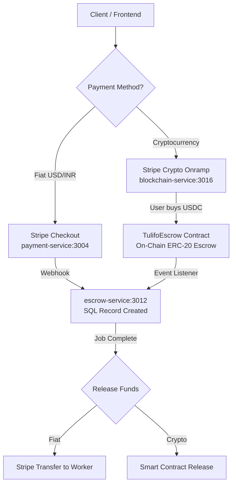

# Blockchain Service Integration Analysis

## 1. What's in the Scratch Folder

The scratch folder at `/Users/mahesh/.gemini/antigravity/scratch` contains a **complete blockchain microservice MVP** with three sub-projects:

### 1.1 Blockchain Service (`apps/blockchain-service/`)

A full Hardhat + Express.js backend that manages on-chain operations:

| Component | Details |
|---|---|
| **Smart Contracts** | 4 Solidity contracts (v0.8.20) with OpenZeppelin |
| **Backend** | Express.js + TypeScript on **port 3016** |
| **Blockchain** | Hardhat (local), Sepolia testnet support |
| **Web3 Library** | ethers.js v6.4.0 |
| **Payments** | Stripe (v14) for crypto onramp |

#### Smart Contracts

| Contract | Purpose | Key Features |
|---|---|---|
| [TulifoEscrow.sol](file:///Users/mahesh/.gemini/antigravity/scratch/apps/blockchain-service/contracts/TulifoEscrow.sol) | ERC-20 escrow for payments | Reentrancy guard, pausable, admin refund, ERC-20 token transfers |
| [TulifoNFT.sol](file:///Users/mahesh/.gemini/antigravity/scratch/apps/blockchain-service/contracts/TulifoNFT.sol) | Skill certificate NFTs | Issue, query, and verify certificates |
| [TulifoReputation.sol](file:///Users/mahesh/.gemini/antigravity/scratch/apps/blockchain-service/contracts/TulifoReputation.sol) | On-chain reputation/ratings | 1-5 star ratings, average calculation |
| [TulifoUSD.sol](file:///Users/mahesh/.gemini/antigravity/scratch/apps/blockchain-service/contracts/TulifoUSD.sol) | Mock ERC-20 stablecoin (TUSD) | Faucet for testing, owner minting |

#### API Routes

| Route | Purpose |
|---|---|
| `/api/v1/escrow/*` | Create, release, refund, and query escrow payments |
| `/api/v1/nft/*` | Issue and query skill certificates |
| `/api/v1/reputation/*` | Add ratings and query reputation |
| `/api/v1/stripe/*` | Stripe Crypto Onramp (fiat → USDC) |
| `/api/v1/faucet/*` | Mint test TUSD tokens (dev only) |

### 1.2 Frontend Sim (`apps/frontend-sim/`)

React components for the Next.js frontend:

| Component | Purpose |
|---|---|
| [CryptoPayment.tsx](file:///Users/mahesh/.gemini/antigravity/scratch/apps/frontend-sim/components/CryptoPayment.tsx) | MetaMask wallet connection + escrow creation UI |
| [NFTCertificates.tsx](file:///Users/mahesh/.gemini/antigravity/scratch/apps/frontend-sim/components/NFTCertificates.tsx) | Display/issue NFT skill certificates |
| [Web3Provider.tsx](file:///Users/mahesh/.gemini/antigravity/scratch/apps/frontend-sim/components/Web3Provider.tsx) | React context for Web3 wallet state |

### 1.3 Frontend (`apps/frontend/`)
Empty — placeholder for future frontend.

---

## 2. Integration with Existing Backend

### Overlap Analysis

Your existing backend already has services that handle similar concerns — but in a **traditional (off-chain)** way. The blockchain service adds an **on-chain** layer:

| Concern | Existing Service | Blockchain Service | Integration Strategy |
|---|---|---|---|
| **Escrow** | `escrow-service` (port 3012) — SQL-based, Supabase | `TulifoEscrow.sol` — on-chain ERC-20 | **Hybrid**: SQL tracks status, blockchain holds funds |
| **Payments** | `payment-service` (port 3004) — Stripe fiat | `stripe-crypto.routes.ts` — Stripe Crypto Onramp | **Extend**: Add crypto option alongside existing Stripe |
| **Reputation** | `review-service` (port 3014) — SQL ratings | `TulifoReputation.sol` — on-chain ratings | **Mirror**: SQL is primary, blockchain is proof layer |
| **Certificates** | *(none)* | `TulifoNFT.sol` — NFT certificates | **New feature**: Add directly |

### Payment Flow Architecture

Since you want **Stripe for normal currency** and **Stripe Crypto for cryptocurrency**:



### Proposed Integration Steps

#### Phase 1: Add `blockchain-service` to the Monorepo

1. **Copy** `scratch/apps/blockchain-service/` → `tulifo-gig-backend/apps/blockchain-service/`
2. **Add to `docker-compose.yml`** as a new service on port 3016
3. **Add to `pnpm-workspace.yaml`** so it's part of the monorepo
4. **Configure `.env`** with blockchain-specific vars (`RPC_URL`, `PRIVATE_KEY`, `CHAIN_ID`)

#### Phase 2: Wire Up Payment Flows

1. **`payment-service`** (existing): Handles Stripe fiat payments (already working)
2. **`blockchain-service`** (new): Handles Stripe Crypto Onramp + on-chain escrow
3. **`escrow-service`** (existing): Acts as the **single source of truth** for escrow status
   - Add a `payment_method` column (`fiat` | `crypto`)
   - Add a `blockchain_tx_hash` column for on-chain references
   - Listen for blockchain events to sync status

#### Phase 3: Frontend Integration

1. Copy `frontend-sim/components/` into the Next.js frontend (`tulifo-gig/`)
2. Add a payment method selector: "Pay with Card" (Stripe) or "Pay with Crypto" (blockchain)
3. Integrate `Web3Provider` at the app root for MetaMask wallet connectivity

---

## 3. Required Changes Summary

### Backend (`tulifo-gig-backend`)

| File/Service | Change | Priority |
|---|---|---|
| `apps/blockchain-service/` | **[NEW]** Copy from scratch, adapt to monorepo conventions | 🔴 High |
| `docker-compose.yml` | Add `blockchain-service` + Hardhat node services | 🔴 High |
| `.env` | Add `RPC_URL`, `PRIVATE_KEY`, `CHAIN_ID`, `STRIPE_SECRET_KEY` (for crypto) | 🔴 High |
| `pnpm-workspace.yaml` | Add `apps/blockchain-service` | 🟡 Medium |
| `apps/escrow-service/` | Add `payment_method`, `blockchain_tx_hash` columns | 🟡 Medium |
| `apps/payment-service/` | Add route to redirect crypto payments to blockchain-service | 🟡 Medium |

### Frontend (`tulifo-gig`)

| File | Change | Priority |
|---|---|---|
| `components/Web3Provider.tsx` | **[NEW]** MetaMask wallet context | 🟡 Medium |
| `components/CryptoPayment.tsx` | **[NEW]** Crypto payment UI | 🟡 Medium |
| `components/NFTCertificates.tsx` | **[NEW]** Skill certificates display | 🟢 Low |
| Payment pages | Add "Pay with Crypto" option alongside existing Stripe | 🟡 Medium |

---

## 4. Free Database for Blockchain Data

Since blockchain data is primarily stored **on-chain** (in the smart contracts), the database is only needed for:
- **Indexing**: Fast lookup of transactions, events, balances
- **Caching**: Avoid repeated RPC calls to the blockchain
- **User mappings**: Link wallet addresses to platform user IDs

### Recommended: **Supabase (PostgreSQL)** — Already in use ✅

You're already using Supabase PostgreSQL for 8 services. The blockchain service can share the same database for its indexing needs. **No new database needed.**

Add these tables to Supabase:

```sql
-- Blockchain transaction log
CREATE TABLE blockchain_transactions (
  id UUID PRIMARY KEY DEFAULT gen_random_uuid(),
  tx_hash VARCHAR(66) NOT NULL UNIQUE,
  contract_name VARCHAR(50) NOT NULL, -- 'escrow', 'nft', 'reputation'
  method_name VARCHAR(100),
  from_address VARCHAR(42),
  to_address VARCHAR(42),
  amount DECIMAL(36, 18),
  block_number BIGINT,
  status VARCHAR(20) DEFAULT 'pending',
  booking_id VARCHAR(100),
  created_at TIMESTAMPTZ DEFAULT NOW()
);

-- Wallet-to-user mapping
CREATE TABLE user_wallets (
  id UUID PRIMARY KEY DEFAULT gen_random_uuid(),
  user_id UUID REFERENCES users(id),
  wallet_address VARCHAR(42) NOT NULL UNIQUE,
  is_primary BOOLEAN DEFAULT true,
  created_at TIMESTAMPTZ DEFAULT NOW()
);

-- NFT certificates (cached from chain)
CREATE TABLE nft_certificates (
  id UUID PRIMARY KEY DEFAULT gen_random_uuid(),
  token_id INTEGER NOT NULL UNIQUE,
  owner_address VARCHAR(42),
  user_id UUID,
  skill_name VARCHAR(100),
  issuer VARCHAR(100),
  issued_at TIMESTAMPTZ,
  tx_hash VARCHAR(66),
  created_at TIMESTAMPTZ DEFAULT NOW()
);
```

### Alternative Free Options (if you want a separate DB)

| Database | Best For | Free Tier |
|---|---|---|
| **Supabase** (current) | Relational indexing, shared with other services | 500 MB, 50K rows |
| **MongoDB Atlas** (current) | Document-based event logs, flexible schema | 512 MB shared |
| **PlanetScale** | MySQL-based, branching for schema changes | Deprecated free tier |
| **Neon** | Serverless PostgreSQL, good for sporadic blockchain queries | 512 MB, 0.25 vCPU |
| **Railway** | PostgreSQL with easy deploy, good DX | $5/month free credit |

> [!TIP]
> **Best approach**: Use your existing Supabase PostgreSQL. It has plenty of capacity for blockchain indexing, avoids adding another service, and keeps your architecture simple. Add the tables above via Drizzle ORM schema + `db:push`.

---

## 5. Integration Risks & Considerations

> [!IMPORTANT]
> **Stripe Crypto Onramp** is currently in **limited availability**. You need to [apply for access](https://stripe.com/docs/crypto/onramp) in the Stripe Dashboard. It may not be available in all regions (India included). Have a fallback plan.

> [!WARNING]
> The scratch code uses **Hardhat Account #0's private key** hardcoded as a default. This is fine for local dev but **must be replaced** with a secure key management solution (e.g., AWS KMS, HashiCorp Vault) before any testnet/mainnet deployment.

> [!CAUTION]
> The `TulifoUSD.sol` faucet function allows **anyone** to mint tokens. This is intentional for testing. In production, you would use a real stablecoin (USDC, USDT) instead of TulifoUSD, and the faucet route must be disabled.

### Other Considerations

- **Gas Fees**: Hardhat local network has no gas cost. Sepolia testnet uses free faucet ETH. For production, consider Layer 2 (Polygon, Arbitrum) to minimize costs
- **Network Choice**: The scratch code targets Ethereum mainnet/Sepolia. For production the Stripe Crypto route already targets **Polygon** (lower fees)
- **Event Indexing**: Consider adding an event listener (or using a service like The Graph) to automatically sync on-chain events to your SQL database

---

## 6. Summary: Is Integration Possible?

**Yes, absolutely.** The scratch code was designed as a standalone service that communicates via REST APIs. Integration requires:

1. **~2 hours**: Copy blockchain-service into monorepo, add Docker config, configure `.env`
2. **~4 hours**: Wire up escrow-service ↔ blockchain-service communication, add payment method tracking
3. **~3 hours**: Add frontend components (CryptoPayment, Web3Provider) to Next.js app
4. **~1 hour**: Add blockchain indexing tables to Supabase (via Drizzle schema)

**Total estimated effort: ~10 hours** for a working integration.
