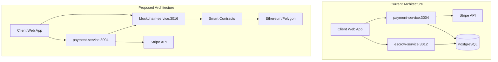
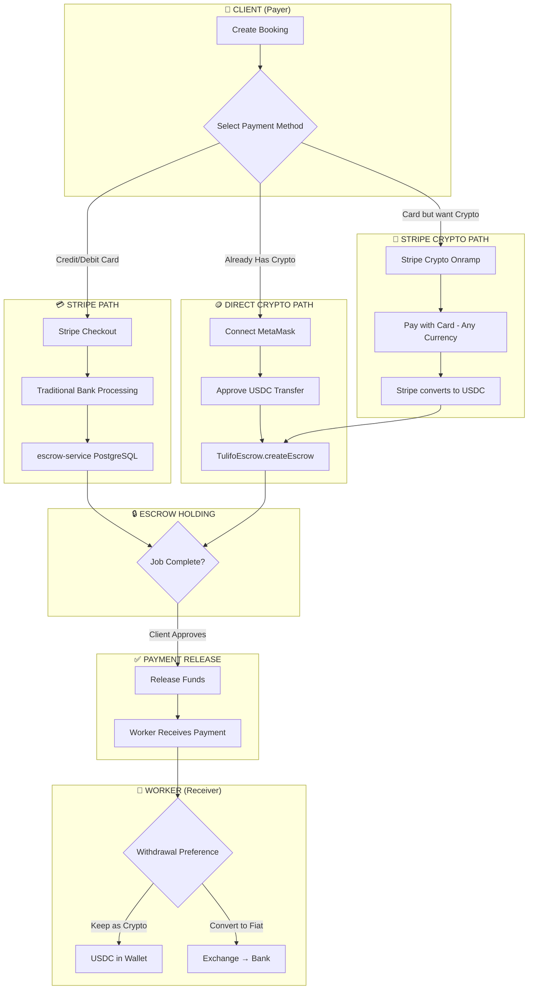

# Tulifo Blockchain Integration - Product Requirements Document (PRD)

**Version:** 1.0  
**Date:** February 8, 2026  
**Author:** Development Team  
**Status:** Ready for Review

---

## Executive Summary

This PRD defines the integration of blockchain technology into the Tulifo gig platform, enabling decentralized secure payments, verifiable skill credentials, and immutable reputation scoring. The proposed implementation leverages the existing blockchain prototype from the scratch directory, enhanced with stablecoin support for real-world usability.

> [!IMPORTANT]
> **Suitability Assessment:** The scratch blockchain implementation is **WELL-SUITED** for the Tulifo MVP. It provides all core features needed with proper security measures (ReentrancyGuard, Pausable, Ownable patterns from OpenZeppelin).

---

## 1. Business Objectives

| Objective | Description | Priority |
|-----------|-------------|----------|
| **Secure Payments** | Eliminate payment fraud through smart contract escrow | P0 |
| **Trust Building** | Immutable on-chain reputation that can't be manipulated | P1 |
| **Skill Verification** | NFT certificates as proof of competency | P1 |
| **Decentralization** | Reduce platform dependency, increase transparency | P2 |
| **Cost Reduction** | Eliminate middleman fees (long-term) | P2 |

---

## 2. System Architecture

### 2.1 Current vs. Proposed Architecture



### 2.2 Service Integration Map

| Existing Service | Port | Blockchain Integration |
|------------------|------|------------------------|
| `payment-service` | 3004 | Add crypto payment option alongside Stripe |
| `escrow-service` | 3012 | Mirror escrow state to blockchain for crypto payments |
| `review-service` | 3014 | Store ratings on-chain via `TulifoReputation` |
| `user-service` | 3002 | Store wallet addresses in user profiles |

---

## 3. Smart Contracts Specification

### 3.1 TulifoEscrow.sol ✅ **Ready for MVP**

**Purpose:** Secure payment holding with automatic release

| Feature | Status | Description |
|---------|--------|-------------|
| ERC-20 Stablecoin Support | ✅ | Uses `TulifoUSD` (or can swap for USDC/USDT) |
| ReentrancyGuard | ✅ | Prevents reentrancy attacks |
| Emergency Pause | ✅ | Admin can freeze all operations |
| Admin Refund | ✅ | Dispute resolution capability |

**Key Functions:**
```solidity
function createEscrow(address _worker, string memory _bookingId, uint256 _amount)
function releaseFunds(bytes32 _escrowId)      // Client releases to worker
function refundClient(bytes32 _escrowId)      // Worker refunds client
function adminRefund(bytes32 _escrowId)       // Admin dispute resolution
```

---

### 3.2 TulifoNFT.sol ✅ **Ready for MVP**

**Purpose:** Skill certification as verifiable credentials

| Feature | Status | Description |
|---------|--------|-------------|
| Certificate Issuance | ✅ | Admin mints skill certificates |
| Certificate Lookup | ✅ | Query by tokenId or owner address |
| Permanent Record | ✅ | Immutable on blockchain |

---

### 3.3 TulifoReputation.sol ✅ **Ready for MVP**

**Purpose:** On-chain rating system (1-5 stars)

| Feature | Status | Description |
|---------|--------|-------------|
| Rating System | ✅ | Tracks total/average ratings |
| Jobs Counter | ✅ | Counts completed jobs |
| Public Access | ✅ | Anyone can query reputation |

---

### 3.4 TulifoUSD.sol ⚠️ **Testnet Only**

**Purpose:** Mock stablecoin for development/testing

> [!CAUTION]
> **Production Note:** Replace with actual USDC/USDT for mainnet deployment. The `faucet()` function is for testing only.

---

## 4. User Flows

### 4.1 Crypto Payment Flow

```
┌─────────────────────────────────────────────────────────────────────┐
│  1. CLIENT CREATES BOOKING                                          │
│     └─ Frontend → booking-service                                   │
├─────────────────────────────────────────────────────────────────────┤
│  2. CLIENT SELECTS "PAY WITH CRYPTO"                                │
│     └─ Frontend shows MetaMask popup                                │
│     └─ Client approves TUSD token transfer                          │
├─────────────────────────────────────────────────────────────────────┤
│  3. ESCROW CREATED ON-CHAIN                                         │
│     └─ blockchain-service calls TulifoEscrow.createEscrow()         │
│     └─ Tokens locked in smart contract                              │
│     └─ escrowId returned and stored in PostgreSQL                   │
├─────────────────────────────────────────────────────────────────────┤
│  4. WORKER COMPLETES JOB                                            │
│     └─ Worker marks job complete via worker-service                 │
├─────────────────────────────────────────────────────────────────────┤
│  5. CLIENT APPROVES & RELEASES                                      │
│     └─ Frontend → blockchain-service → TulifoEscrow.releaseFunds()  │
│     └─ Worker receives TUSD in their wallet                         │
├─────────────────────────────────────────────────────────────────────┤
│  6. RATING SUBMITTED                                                │
│     └─ review-service → blockchain-service                          │
│     └─ TulifoReputation.addRating() called                          │
│     └─ Worker's on-chain reputation updated                         │
└─────────────────────────────────────────────────────────────────────┘
```

---

## 5. API Endpoints

### 5.1 Escrow APIs

| Method | Endpoint | Description |
|--------|----------|-------------|
| `POST` | `/api/v1/escrow/create` | Create new escrow |
| `POST` | `/api/v1/escrow/release` | Release funds to worker |
| `POST` | `/api/v1/escrow/refund` | Refund to client |
| `GET` | `/api/v1/escrow/:id/status` | Get escrow details |

### 5.2 NFT APIs

| Method | Endpoint | Description |
|--------|----------|-------------|
| `POST` | `/api/v1/nft/issue` | Issue skill certificate |
| `GET` | `/api/v1/nft/certificates/:address` | Get user's certificates |
| `GET` | `/api/v1/nft/:tokenId` | Get certificate details |

### 5.3 Reputation APIs

| Method | Endpoint | Description |
|--------|----------|-------------|
| `POST` | `/api/v1/reputation/rate` | Add rating |
| `GET` | `/api/v1/reputation/:address` | Get reputation score |

---

## 6. Database Schema Changes

### 6.1 User Table Extensions

```sql
ALTER TABLE users ADD COLUMN wallet_address VARCHAR(42);
ALTER TABLE users ADD COLUMN wallet_verified BOOLEAN DEFAULT false;
```

### 6.2 Blockchain Transactions Table

```sql
CREATE TABLE blockchain_transactions (
  id UUID PRIMARY KEY DEFAULT gen_random_uuid(),
  booking_id UUID REFERENCES bookings(id),
  escrow_id VARCHAR(66),                    -- bytes32 from contract
  transaction_hash VARCHAR(66),
  tx_type VARCHAR(20),                      -- 'escrow_create', 'release', 'refund'
  amount DECIMAL(18, 6),
  status VARCHAR(20),                       -- 'pending', 'confirmed', 'failed'
  created_at TIMESTAMP DEFAULT NOW(),
  confirmed_at TIMESTAMP
);
```

---

## 7. Technical Requirements

### 7.1 Dependencies

| Package | Version | Purpose |
|---------|---------|---------|
| `ethers` | ^6.4.0 | Web3 library |
| `hardhat` | ^2.19.0 | Development framework |
| `@openzeppelin/contracts` | ^5.0.0 | Secure contract patterns |

### 7.2 Network Configuration

| Network | Chain ID | Usage | Cost |
|---------|----------|-------|------|
| Hardhat Local | 31337 | Development | $0 |
| Sepolia Testnet | 11155111 | Testing | Free (faucet) |
| Polygon Mainnet | 137 | Production | Low gas fees |

---

## 8. Security Considerations

| Risk | Mitigation | Status |
|------|------------|--------|
| Reentrancy Attacks | OpenZeppelin ReentrancyGuard | ✅ Implemented |
| Access Control | Ownable pattern + role checks | ✅ Implemented |
| Emergency Stop | Pausable pattern | ✅ Implemented |
| Private Key Exposure | Environment variables, never in code | ⚠️ Needs verification |
| Smart Contract Bugs | Test coverage + optional audit | 📋 Pending |

---

## 9. Implementation Roadmap

### Phase 1: Foundation (Week 1)
- [ ] Copy blockchain-service from scratch to apps/
- [ ] Setup Hardhat configuration
- [ ] Deploy contracts to local node
- [ ] Verify all tests pass

### Phase 2: Integration (Week 2)
- [ ] Add wallet_address to user schema
- [ ] Create blockchain_transactions table
- [ ] Integrate blockchain-service with payment-service
- [ ] Add crypto payment option to frontend

### Phase 3: Testing (Week 3)
- [ ] End-to-end payment flow testing
- [ ] Testnet deployment (Sepolia)
- [ ] Frontend MetaMask integration
- [ ] Error handling and edge cases

### Phase 4: Production Prep (Week 4)
- [ ] Swap TulifoUSD for real stablecoin (USDC)
- [ ] Deploy to Polygon mainnet
- [ ] Security review
- [ ] Documentation finalization

---

## 10. Cost Analysis

### 10.1 Development Costs

| Phase | Cost |
|-------|------|
| Local Development | $0 |
| Testnet Testing | $0 (free ETH from faucet) |
| Mainnet Deployment | ~$5-20 (one-time gas) |
| Per Transaction (Polygon) | ~$0.01-0.05 |

### 10.2 vs. Traditional Payment

| Method | Platform Fee | Per Transaction |
|--------|--------------|-----------------|
| Stripe | 2.9% + $0.30 | High for micropayments |
| PayPal | 2.9% + $0.30 | High for micropayments |
| **Blockchain (Polygon)** | **0%** | **~$0.01-0.05** |

---

## 11. Success Metrics

| Metric | Target | Measurement |
|--------|--------|-------------|
| Transaction Success Rate | > 99% | Monitor failed transactions |
| Avg Transaction Time | < 30 seconds | Time from initiation to confirmation |
| User Wallet Adoption | 20% of users | Wallets linked / total users |
| Dispute Rate | < 2% | Disputes / total transactions |

---

## 12. Risks and Mitigations

| Risk | Probability | Impact | Mitigation |
|------|-------------|--------|------------|
| User unfamiliarity with crypto | High | Medium | Provide tutorial, fallback to Stripe |
| Wallet private key loss | Medium | High | Clear warnings, not our responsibility |
| Smart contract vulnerability | Low | Critical | OpenZeppelin patterns, testing, audit |
| Network congestion | Medium | Low | Use Polygon (low fees, fast) |

---

## 13. Global Currency Support & Fiat On-Ramp

> [!NOTE]
> Smart contracts cannot directly hold fiat currency (USD, EUR, INR, etc.). This section defines how Tulifo enables **worldwide payments** using stablecoins and fiat on-ramp services.

### 13.1 Stablecoins (Blockchain Native Currencies)

Stablecoins are cryptocurrencies pegged 1:1 to fiat currencies, enabling stable value transfers:

| Stablecoin | Pegged To | Market Cap | Recommended Use |
|------------|-----------|------------|-----------------|
| **USDC** | $1 USD | ~$30B | ✅ Primary (Most trusted, regulated) |
| **USDT (Tether)** | $1 USD | ~$100B | Alternative (Most widely used) |
| **DAI** | $1 USD | ~$5B | Decentralized option |
| **EURC** | €1 EUR | Growing | European markets |

**Production Recommendation:** Use **USDC on Polygon** for low fees and high trust.

---

### 13.2 Stripe Crypto Onramp (Recommended) ✅

> [!TIP]
> **Why Stripe Crypto?** You already use Stripe for payments, so adding crypto is seamless - same dashboard, same account, no new third-party signups!

**Stripe Crypto Features:**

| Feature | Status | Details |
|---------|--------|--------|
| **USDC Payments** | ✅ Available | Accept USDC as payment |
| **Card → Crypto** | ✅ Available | Users buy crypto with cards |
| **Auto-conversion** | ✅ Available | USDC → USD automatically |
| **KYC/Compliance** | ✅ Handled | Stripe manages all compliance |
| **Fraud Prevention** | ✅ Built-in | Same Stripe Radar protection |

**Supported Blockchains:**
- ✅ **Polygon** (recommended - low fees)
- ✅ Ethereum
- ✅ Solana
- ✅ Base
- ✅ Avalanche

**Supported Regions:**

| Region | Status | Notes |
|--------|--------|-------|
| United States | ✅ Full | All features available |
| European Union | ✅ Available | Card → Crypto purchases |
| United Kingdom | ✅ Available | Exchange support |
| Australia | ✅ Available | Exchange support |
| Singapore | ✅ Available | Exchange support |
| India | ⚠️ Check | Verify Stripe India crypto status |

---

### 13.3 Payment Options Architecture

```
┌─────────────────────────────────────────────────────────────────────────────┐
│                    TULIFO PAYMENT OPTIONS                                    │
├─────────────────────────────────────────────────────────────────────────────┤
│                                                                             │
│  ┌─────────────────────┐  ┌─────────────────────┐  ┌─────────────────────┐ │
│  │   💳 OPTION 1       │  │   🪙 OPTION 2       │  │   🔄 OPTION 3       │ │
│  │   Credit/Debit      │  │   Direct Crypto     │  │   Card → Crypto     │ │
│  │   (via Stripe)      │  │   (Wallet)          │  │   (Stripe Crypto)   │ │
│  └──────────┬──────────┘  └──────────┬──────────┘  └──────────┬──────────┘ │
│             │                        │                        │             │
│             ▼                        ▼                        ▼             │
│  ┌─────────────────────┐  ┌─────────────────────┐  ┌─────────────────────┐ │
│  │ Traditional Rails   │  │ Blockchain Direct   │  │ Fiat → Stablecoin  │ │
│  │ • 195+ countries    │  │ • Any wallet holder │  │ • Best of both     │ │
│  │ • 2.9% + $0.30 fee  │  │ • ~$0.01-0.05 fee   │  │ • ~2-3% fee        │ │
│  │ • 2-7 day settle    │  │ • Instant settle    │  │ • Instant settle   │ │
│  └──────────┬──────────┘  └──────────┬──────────┘  └──────────┬──────────┘ │
│             │                        │                        │             │
│             ▼                        ▼                        ▼             │
│  ┌─────────────────────────────────────────────────────────────────────────┐│
│  │                    ESCROW (Smart Contract or DB)                       ││
│  │            Funds held securely until job completion                    ││
│  └─────────────────────────────────────────────────────────────────────────┘│
│             │                        │                        │             │
│             ▼                        ▼                        ▼             │
│  ┌─────────────────────────────────────────────────────────────────────────┐│
│  │                         WORKER RECEIVES PAYMENT                        ││
│  │   Option 1: Bank deposit | Option 2: USDC wallet | Option 3: USDC     ││
│  └─────────────────────────────────────────────────────────────────────────┘│
│                                                                             │
└─────────────────────────────────────────────────────────────────────────────┘
```

---

### 13.4 Complete Payment Flow Diagram (All Options)



---

### 13.5 Detailed Card-to-Crypto Flow (Stripe Crypto Onramp)

```
┌─────────────────────────────────────────────────────────────────────────────┐
│                    STRIPE CRYPTO ONRAMP FLOW                                 │
├─────────────────────────────────────────────────────────────────────────────┤
│                                                                             │
│  STEP 1: User selects "Pay with Crypto" at checkout                        │
│  ┌─────────────────────────────────────────────────────────────────────┐   │
│  │  Tulifo checkout shows payment options:                             │   │
│  │  [💳 Card]  [🪙 Crypto Wallet]  [🔄 Buy Crypto with Card]           │   │
│  │                                                                      │   │
│  │  User clicks "Buy Crypto with Card"                                 │   │
│  └─────────────────────────────────────────────────────────────────────┘   │
│                                     │                                       │
│                                     ▼                                       │
│  STEP 2: Stripe Crypto Checkout Opens (Same Stripe UI)                     │
│  ┌─────────────────────────────────────────────────────────────────────┐   │
│  │  ┌───────────────────────────────────────────────────────────────┐  │   │
│  │  │  💳 Stripe Checkout                                           │  │   │
│  │  │                                                                │  │   │
│  │  │  Pay for: Web Design Service                                   │  │   │
│  │  │  Amount: $50.00 USD                                            │  │   │
│  │  │  Payment: USDC on Polygon                                      │  │   │
│  │  │                                                                │  │   │
│  │  │  Card Number: **** **** **** 1234                             │  │   │
│  │  │  Expiry: 12/27    CVC: ***                                    │  │   │
│  │  │                                                                │  │   │
│  │  │  ✅ Stripe handles KYC/compliance automatically               │  │   │
│  │  │                                                                │  │   │
│  │  │  [Pay $50.00]                                                  │  │   │
│  │  └───────────────────────────────────────────────────────────────┘  │   │
│  └─────────────────────────────────────────────────────────────────────┘   │
│                                     │                                       │
│                                     ▼                                       │
│  STEP 3: Stripe Processes Everything                                       │
│  ┌─────────────────────────────────────────────────────────────────────┐   │
│  │  Stripe Crypto Onramp:                                              │   │
│  │  ✅ Charges user's card in their local currency                    │   │
│  │  ✅ Handles KYC verification (if needed)                           │   │
│  │  ✅ Converts to USDC on Polygon                                    │   │
│  │  ✅ Sends USDC to user's wallet or escrow contract                 │   │
│  │  ✅ Webhook notifies Tulifo backend                                │   │
│  └─────────────────────────────────────────────────────────────────────┘   │
│                                     │                                       │
│                                     ▼                                       │
│  STEP 4: Escrow Created                                                    │
│  ┌─────────────────────────────────────────────────────────────────────┐   │
│  │  ✅ USDC locked in smart contract                                  │   │
│  │  ✅ escrowId stored in database                                     │   │
│  │  ✅ Worker notified of new job                                      │   │
│  └─────────────────────────────────────────────────────────────────────┘   │
│                                                                             │
└─────────────────────────────────────────────────────────────────────────────┘
```

---

### 13.6 Worker Withdrawal Options

```
┌─────────────────────────────────────────────────────────────────────────────┐
│                    WORKER WITHDRAWAL OPTIONS                                 │
├─────────────────────────────────────────────────────────────────────────────┤
│                                                                             │
│  Worker receives USDC in their Polygon wallet                              │
│                         │                                                   │
│         ┌───────────────┼───────────────┐                                  │
│         ▼               ▼               ▼                                  │
│  ┌─────────────┐ ┌─────────────┐ ┌─────────────┐                          │
│  │ OPTION A    │ │ OPTION B    │ │ OPTION C    │                          │
│  │ Keep USDC   │ │ Exchange    │ │ Off-Ramp    │                          │
│  │             │ │ to ETH/BTC  │ │ to Bank     │                          │
│  └─────────────┘ └─────────────┘ └─────────────┘                          │
│        │               │               │                                   │
│        ▼               ▼               ▼                                   │
│  ┌─────────────┐ ┌─────────────┐ ┌─────────────┐                          │
│  │ Use for     │ │ Use DEX:    │ │ Use:        │                          │
│  │ future      │ │ • Uniswap   │ │ • Stripe    │                          │
│  │ payments    │ │ • 1inch     │ │ • Coinbase  │                          │
│  │ on Tulifo   │ │ • SushiSwap │ │ • Binance   │                          │
│  └─────────────┘ └─────────────┘ └─────────────┘                          │
│        │               │               │                                   │
│        ▼               ▼               ▼                                   │
│    No fees         ~0.3% fee      ~1-3% fee                                │
│    Instant         Instant        1-3 business days                        │
│                                                                             │
└─────────────────────────────────────────────────────────────────────────────┘
```

---

### 13.7 Global Currency Comparison

| Feature | Stripe (Traditional) | Stripe Crypto Onramp | Direct Crypto |
|---------|---------------------|---------------------|---------------|
| **Supported Countries** | 46 (full) | 150+ | Unlimited |
| **Supported Currencies** | 135+ fiat | Any → USDC | USDC only |
| **Platform Fees** | 2.9% + $0.30 | ~1.5% | 0% |
| **Gas Fees** | N/A | ~$0.01 | ~$0.01 |
| **Settlement Time** | 2-7 days | Instant | Instant |
| **KYC/Compliance** | Stripe handles | Stripe handles | User responsibility |
| **Chargebacks** | Possible | Not possible | Not possible |
| **Micropayments** | Expensive | Cheap | Cheapest |
| **User Experience** | Familiar | Familiar | Requires wallet |

---

### 13.8 Recommended Payment Stack for Tulifo

```
┌─────────────────────────────────────────────────────────────────┐
│                   RECOMMENDED PAYMENT STACK                      │
├─────────────────────────────────────────────────────────────────┤
│                                                                 │
│  PRIMARY (Default for all users):                               │
│  ┌─────────────────────────────────────────────────────────┐   │
│  │  💳 Stripe                                               │   │
│  │  • Familiar to all users                                 │   │
│  │  • Full country/currency support                         │   │
│  │  • Handles compliance/disputes                           │   │
│  └─────────────────────────────────────────────────────────┘   │
│                                                                 │
│  SECONDARY (Opt-in for lower fees):                            │
│  ┌─────────────────────────────────────────────────────────┐   │
│  │  🪙 Direct Crypto (MetaMask + USDC)                      │   │
│  │  • For crypto-native users                               │   │
│  │  • Lowest fees possible                                  │   │
│  │  • Instant settlement                                    │   │
│  └─────────────────────────────────────────────────────────┘   │
│                                                                 │
│  BRIDGE (For users wanting crypto benefits without wallet):    │
│  ┌─────────────────────────────────────────────────────────┐   │
│  │  🔄 Stripe Crypto Onramp                                 │   │
│  │  • Same Stripe checkout experience                       │   │
│  │  • Pay with card, settle in USDC                         │   │
│  │  • Stripe handles KYC/compliance                         │   │
│  │  • No new account needed - uses existing Stripe          │   │
│  └─────────────────────────────────────────────────────────┘   │
│                                                                 │
└─────────────────────────────────────────────────────────────────┘
```

---

## 14. Future Enhancements

1. **Multi-signature Escrow** - Require multiple approvals for large amounts
2. **Dispute DAO** - Community-driven dispute resolution
3. **TULIFO Token** - Platform governance and rewards
4. **Cross-chain Support** - Multiple blockchain networks
5. **Layer 2 Scaling** - Optimism/Arbitrum for even lower fees

---

## Appendix A: File Structure

```
apps/blockchain-service/
├── contracts/
│   ├── TulifoEscrow.sol      # ERC-20 escrow with security
│   ├── TulifoNFT.sol         # Skill certificates
│   ├── TulifoReputation.sol  # On-chain ratings
│   └── TulifoUSD.sol         # Test stablecoin
├── src/
│   ├── index.ts              # Express server
│   ├── services/             # Business logic
│   └── routes/               # API endpoints
├── test/                     # Hardhat tests
├── scripts/                  # Deployment scripts
└── hardhat.config.ts         # Network configuration
```

---

## Appendix B: Approval

| Role | Name | Date | Status |
|------|------|------|--------|
| Product Owner | | | Pending |
| Tech Lead | | | Pending |
| Security Review | | | Pending |

---

**Document Status:** Ready for Review  
**Next Steps:** Obtain stakeholder approval before proceeding to implementation
