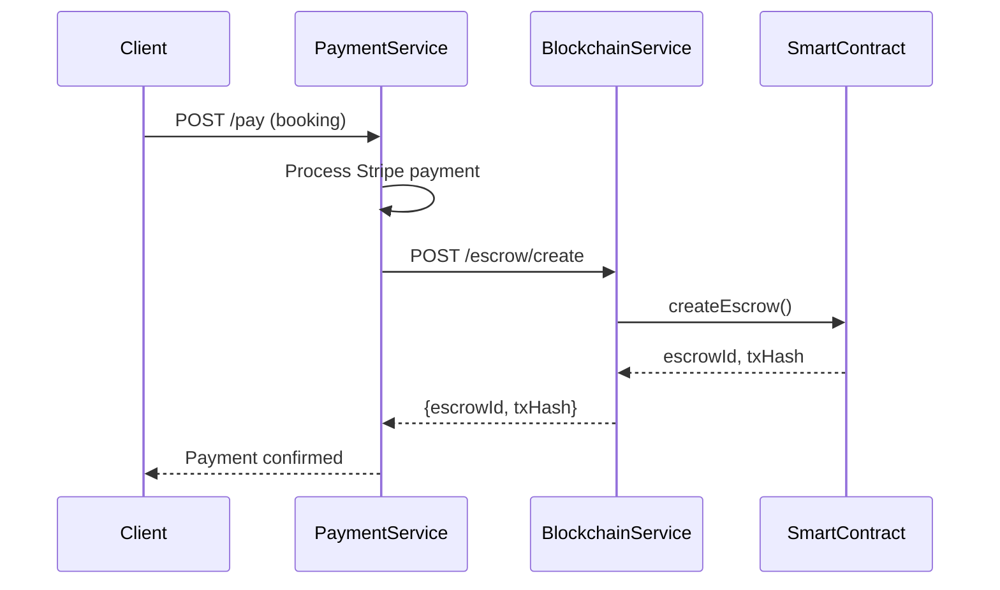
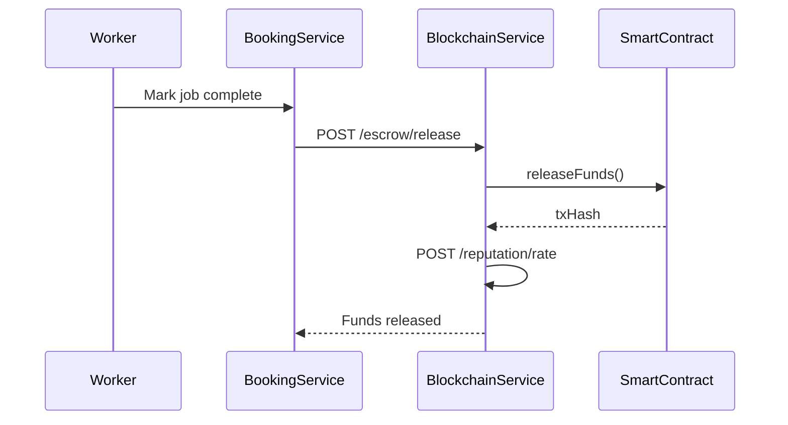

# Blockchain Service Integration Guide

## Overview

This guide explains how to integrate the `blockchain-service` with other Tulifo microservices.

---

## Architecture

```
┌─────────────────┐     ┌─────────────────┐     ┌──────────────────┐
│  payment-service │────▶│blockchain-service│────▶│  Smart Contracts │
│  (Stripe + Fiat) │     │   (Port 3016)   │     │  (Polygon/ETH)   │
└─────────────────┘     └─────────────────┘     └──────────────────┘
         │                       │
         │                       ▼
         │              ┌─────────────────┐
         └─────────────▶│  escrow-service │
                        │  (PostgreSQL)   │
                        └─────────────────┘
```

---

## Service URLs

| Service | Port | Base URL |
|---------|------|----------|
| blockchain-service | 3016 | `http://localhost:3016/api/v1` |
| payment-service | 3004 | `http://localhost:3004/api/payments` |
| escrow-service | 3012 | `http://localhost:3012/api/v1/escrow` |
| user-service | 3001 | `http://localhost:3001/api/v1/users` |

---

## Integration Flows

### 1. Payment Flow (Fiat → Crypto → Escrow)



### 2. Job Completion Flow



---

## Integration Code Examples

### Payment Service Integration

```typescript
// apps/payment-service/src/services/blockchain.client.ts

import axios from 'axios';

const BLOCKCHAIN_URL = process.env.BLOCKCHAIN_SERVICE_URL || 'http://localhost:3016';

export class BlockchainClient {
  
  // Create escrow after payment
  async createEscrow(data: {
    bookingId: string;
    clientAddress: string;
    workerAddress: string;
    amount: string;
  }) {
    const response = await axios.post(
      `${BLOCKCHAIN_URL}/api/v1/escrow/create`,
      data
    );
    return response.data;
  }

  // Release escrow on job completion
  async releaseEscrow(escrowId: string) {
    const response = await axios.post(
      `${BLOCKCHAIN_URL}/api/v1/escrow/release`,
      { escrowId }
    );
    return response.data;
  }

  // Refund on cancellation
  async refundEscrow(escrowId: string) {
    const response = await axios.post(
      `${BLOCKCHAIN_URL}/api/v1/escrow/refund`,
      { escrowId }
    );
    return response.data;
  }

  // Get escrow status
  async getEscrowStatus(escrowId: string) {
    const response = await axios.get(
      `${BLOCKCHAIN_URL}/api/v1/escrow/${escrowId}/status`
    );
    return response.data;
  }

  // Issue skill certificate
  async issueCertificate(data: {
    recipientAddress: string;
    skillName: string;
    level: string;
  }) {
    const response = await axios.post(
      `${BLOCKCHAIN_URL}/api/v1/nft/issue`,
      data
    );
    return response.data;
  }

  // Add reputation rating
  async addRating(workerAddress: string, rating: number) {
    const response = await axios.post(
      `${BLOCKCHAIN_URL}/api/v1/reputation/rate`,
      { workerAddress, rating }
    );
    return response.data;
  }
}

export const blockchainClient = new BlockchainClient();
```

### Using in Payment Routes

```typescript
// apps/payment-service/src/routes/payment.routes.ts

import { blockchainClient } from '../services/blockchain.client';

// After Stripe payment succeeds
router.post('/complete-payment', async (req, res) => {
  const { bookingId, clientWallet, workerWallet, amount } = req.body;

  try {
    // 1. Create blockchain escrow
    const escrowResult = await blockchainClient.createEscrow({
      bookingId,
      clientAddress: clientWallet,
      workerAddress: workerWallet,
      amount: amount.toString()
    });

    // 2. Store reference in database
    await pool.query(
      `UPDATE payments SET 
        escrow_id = $1, 
        blockchain_tx = $2,
        status = 'escrowed'
       WHERE booking_id = $3`,
      [escrowResult.data.escrowId, escrowResult.data.transactionHash, bookingId]
    );

    res.json({ success: true, escrow: escrowResult.data });
  } catch (error) {
    res.status(500).json({ error: error.message });
  }
});
```

---

## User Service: Wallet Integration

```typescript
// apps/user-service/src/routes/wallet.routes.ts

router.post('/link-wallet', async (req, res) => {
  const { userId, walletAddress, signature } = req.body;

  // Verify wallet ownership via signature
  // ... signature verification logic ...

  await pool.query(
    `UPDATE users SET 
      wallet_address = $1,
      wallet_verified = true,
      wallet_linked_at = NOW()
     WHERE id = $2`,
    [walletAddress, userId]
  );

  res.json({ success: true, walletAddress });
});

router.get('/:userId/wallet', async (req, res) => {
  const result = await pool.query(
    'SELECT wallet_address, wallet_verified FROM users WHERE id = $1',
    [req.params.userId]
  );
  res.json(result.rows[0]);
});
```

---

## Database Schema Updates

```sql
-- Add to users table
ALTER TABLE users ADD COLUMN wallet_address VARCHAR(42);
ALTER TABLE users ADD COLUMN wallet_verified BOOLEAN DEFAULT false;

-- Add blockchain tracking to payments
ALTER TABLE payments ADD COLUMN escrow_id VARCHAR(66);
ALTER TABLE payments ADD COLUMN blockchain_tx VARCHAR(66);
ALTER TABLE payments ADD COLUMN payment_method VARCHAR(20) DEFAULT 'fiat';

-- Create blockchain transactions table
CREATE TABLE blockchain_transactions (
  id UUID PRIMARY KEY DEFAULT gen_random_uuid(),
  booking_id UUID REFERENCES bookings(id),
  escrow_id VARCHAR(66),
  tx_hash VARCHAR(66) NOT NULL,
  tx_type VARCHAR(20) NOT NULL,
  amount DECIMAL(18,6),
  status VARCHAR(20) DEFAULT 'pending',
  created_at TIMESTAMP DEFAULT NOW(),
  confirmed_at TIMESTAMP
);

CREATE INDEX idx_bc_tx_booking ON blockchain_transactions(booking_id);
CREATE INDEX idx_bc_tx_escrow ON blockchain_transactions(escrow_id);
```

---

## Environment Variables

Add to each service's `.env`:

```env
# Blockchain Service URL
BLOCKCHAIN_SERVICE_URL=http://localhost:3016
```

---

## Event Sync Pattern

For real-time updates, use webhooks or message queue:

```typescript
// blockchain-service: Emit events on transactions

import { EventEmitter } from 'events';

export const blockchainEvents = new EventEmitter();

// In escrow.service.ts
async createEscrow(data) {
  const result = await contract.createEscrow(...);
  
  // Emit event for other services
  blockchainEvents.emit('escrow:created', {
    escrowId: result.escrowId,
    bookingId: data.bookingId,
    amount: data.amount,
    txHash: result.transactionHash
  });
  
  return result;
}

// Webhook endpoint for external listeners
router.post('/webhooks/escrow', (req, res) => {
  const { event, data } = req.body;
  blockchainEvents.emit(event, data);
  res.json({ received: true });
});
```

---

## Testing Integration

```bash
# 1. Start all services
# Terminal 1: Blockchain
cd apps/blockchain-service && npx hardhat node

# Terminal 2: Deploy + Start blockchain service
cd apps/blockchain-service && pnpm run deploy:local && pnpm run dev

# Terminal 3: Payment service
cd apps/payment-service && pnpm run dev

# 2. Test integration
curl -X POST http://localhost:3004/api/payments/crypto/initiate \
  -H "Content-Type: application/json" \
  -d '{
    "bookingId": "test-001",
    "clientWallet": "0xf39Fd6e51aad88F6F4ce6aB8827279cffFb92266",
    "workerWallet": "0x70997970C51812dc3A010C7d01b50e0d17dc79C8",
    "amount": "100"
  }'
```

---

## Quick Reference

| Operation | Service | Endpoint |
|-----------|---------|----------|
| Create Escrow | blockchain | `POST /api/v1/escrow/create` |
| Release Funds | blockchain | `POST /api/v1/escrow/release` |
| Refund | blockchain | `POST /api/v1/escrow/refund` |
| Issue NFT | blockchain | `POST /api/v1/nft/issue` |
| Add Rating | blockchain | `POST /api/v1/reputation/rate` |
| Link Wallet | user | `POST /api/v1/users/link-wallet` |
| Crypto Payment | payment | `POST /api/payments/crypto/initiate` |
